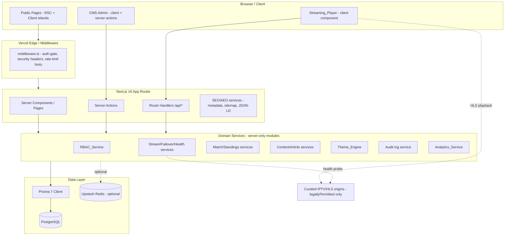
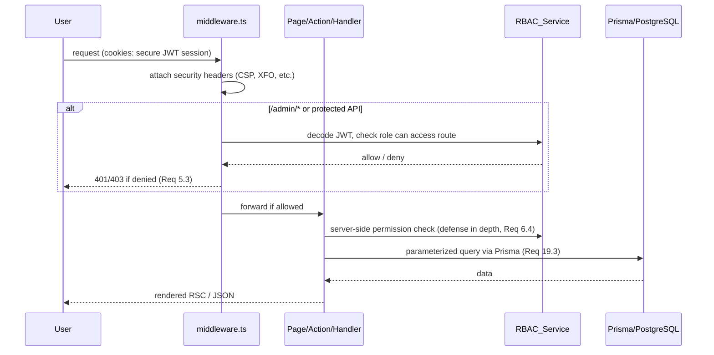
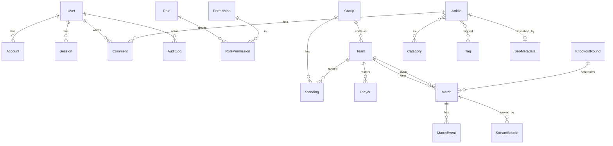
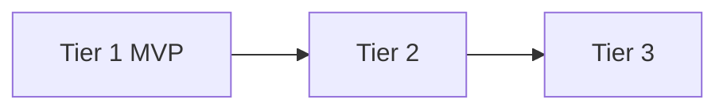

# Design Document — KOORAKIT (World Cup 2026 Platform)

## Overview

KOORAKIT is a premium, production-ready football streaming and news platform themed around the 2026 World Cup. It is built inside the existing `platform/` Next.js application (Next.js 16 App Router, React 19, TypeScript, Tailwind CSS v4, Prisma 7) and targets PostgreSQL in production. The platform delivers four major capability areas plus cross-cutting concerns:

1. **Custom Streaming experience** — a fully custom React player (HLS.js + Video.js) with adaptive bitrate, DVR, quality selection, multi-source failover, health monitoring, and Tier-3 casting/PiP/multi-audio. No iframes or third-party embeds.
2. **Match Center** — fixtures, live events, group standings, knockout brackets, team/player profiles.
3. **CMS / Admin** — dashboard plus modules for content, streaming, match, and tournament management, gated by a 6-role RBAC model with audit logging.
4. **Content / News** — rich-text articles with categories, tags, SEO metadata, related content, and social sharing.

Cross-cutting subsystems: Theme_Engine (KOORAKIT dark-first palette derived from the official logo), SEO_Service and AEO_Service (metadata, sitemaps, structured data), Analytics_Service (GA4/GTM/AdSense), plus platform-wide performance, accessibility, and security strategies.

This design is **phased to the requirement tiers** so delivery is incremental: Tier 1 (MVP) first, then Tier 2, then Tier 3. The phasing plan and a full requirements traceability matrix appear at the end of the document.

### Brand identity (resolves Open Question #1)

The official custom logo has been provided. The brand is **KOORAKIT** with the tagline "The Global Football Festival." The logo is original artwork (globe, trophy, star, and USA/Mexico flag motifs); it is not FIFA branding, and Requirement 21 (no FIFA marks) continues to apply in full. The placeholder "FIFA World Cup 2026™" badge in `src/app/page.tsx` is replaced with KOORAKIT branding. The Theme_Engine default dark palette is derived from the logo and documented as design tokens in the Theming section.

### Assumptions for remaining open questions

These are explicit, labeled design decisions for the still-open questions. They can be revisited without invalidating the architecture.

- **Q2 — IPTV legality (assumption):** No specific copyrighted stream is bundled or hardcoded. A `StreamSource` model carries an explicit `legallyPermitted` boolean and an admin-curated origin allow-list. The player and any ingestion path use only sources flagged permitted (satisfies Req 2.6, 21.3).
- **Q3 — Legacy Express app (assumption):** The legacy Express + EJS + SQLite aggregator is retired after a one-time data migration. A Prisma seed/import script reads `data/*.json` into PostgreSQL. The legacy app is reference-only; no runtime dependency.
- **Q4 — Next.js version (assumption):** Target the installed **Next.js 16** (App Router). Design uses App Router conventions (route groups, server components, `generateMetadata`, Route Handlers).
- **Q5 — Data sources (assumption):** CMS manual entry is the source of truth. An optional import script seeds from legacy `data/*.json`. No hard dependency on a paid third-party sports API; an adapter seam is left open for one later.
- **Q6 — Auth providers (assumption):** v1 supports **email (credentials + magic link)** and **Google** only. Additional providers are config-additive later.
- **Q7 — Hosting / Redis (assumption):** Deploy to **Vercel**. Redis caching (Upstash) is **optional** (Tier 3); when unconfigured, caching gracefully falls back to in-process/ISR behavior with no functional loss.

## Architecture

### High-level system



### App Router structure and route groups

Route groups separate public, admin, and API concerns while sharing the root layout and Theme_Engine. (Satisfies Req 6.2, 5.3, 10.x.)

```
src/
  middleware.ts                 # auth gate + security headers + rate-limit (Req 5.3, 19.1/19.4/19.5)
  app/
    layout.tsx                  # root: ThemeProvider, fonts, base metadata, JSON-LD Organization
    (public)/
      page.tsx                  # Home (Req 10)
      live/page.tsx             # live match listing + player entry (Req 1, 10.3)
      matches/                  # Match Center list + [id] detail w/ tabs (Req 3)
      standings/page.tsx        # group tables (Req 3.3)
      bracket/page.tsx          # knockout brackets (Req 3.4)
      teams/[slug]/page.tsx     # team profile
      players/[id]/page.tsx     # player profile (Req 3.5)
      news/                     # article list + [slug] detail (Req 11)
      faq/page.tsx              # AEO FAQ surface (Req 13.2)
    (admin)/admin/
      layout.tsx                # admin shell; server-side role gate (Req 5.3, 6.4)
      page.tsx                  # dashboard (Req 6.1)
      content/ , streams/ , matches/ , tournament/ , ads/ , faq/ , users/ , settings/
    api/
      auth/[...nextauth]/route.ts   # NextAuth (Req 5.1, 5.4)
      streams/health/route.ts       # health probe trigger/report (Req 2.3, 2.5)
      streams/[matchId]/route.ts    # resolve ordered failover playlist (Req 1.7, 2.4)
      ads/[id]/event/route.ts       # impression/click counters (Req 14.5)
      analytics/video/route.ts      # video view events (Req 14.3)
    sitemap.ts                  # XML sitemap (Req 8.2)
    robots.ts                   # robots directives (Req 8.3)
  components/                   # player, match-center, cms, ui primitives
  lib/                          # server-only domain services + pure logic modules
  themes/                       # KOORAKIT tokens
  prisma/                       # schema + migrations + seed
```

### Server vs client component strategy

- **Default to React Server Components (RSC)** for data-fetching pages (home, match center, news, standings, bracket) to maximize performance and SEO (Req 17.1, 17.3, 20.x). Data is fetched directly via Prisma in server components/services.
- **Client components** are isolated islands where interactivity or browser APIs are required: `Streaming_Player`, theme switcher, live-event auto-refresh, admin editors, animation wrappers (framer-motion). This keeps client JS minimal for code-splitting/lazy-loading (Req 17.3).
- **Server Actions** handle CMS mutations (create/update/delete) with server-side RBAC checks and audit logging (Req 6.3, 6.5). **Route Handlers** serve machine/client endpoints (stream resolution, health, analytics, ad events).
- **ISR** (`revalidate`) for semi-static public pages (news, completed matches, standings) and on-demand revalidation when the CMS publishes changes (Req 17.4).

### Request/auth flow



## Components and Interfaces

### 1. Streaming_Player (Req 1, 2, 15)

A client component composed of a thin Video.js shell for chrome/controls and HLS.js for adaptive playback, with a pure-logic failover controller separated from the React/DOM layer so it can be unit/property tested.

```
components/player/
  StreamingPlayer.tsx        # client wrapper: mounts video.js + hls.js, wires controls
  controls/                  # play/pause, volume, seek, fullscreen, quality, live badge, DVR (Req 1.3-1.6)
  cast/                      # PiP, AirPlay, Chromecast, audio-track menu (Req 15, Tier 3)
lib/player/
  failover.ts                # PURE: ordered backup selection + advance-on-failure (Req 1.7, 2.4)
  health.ts                  # probe a source, classify result (Req 2.3)
  playlist.ts                # build resolved, permitted, ordered source list (Req 2.6, 21.3)
```

Key interfaces:

```ts
type StreamType = "hls" | "dash";

interface ResolvedSource {
  id: string;
  url: string;
  quality: string;          // "1080p" | "720p" | "auto" ...
  language: string;         // ISO-ish code, e.g. "EN", "FR"
  type: StreamType;
  priority: number;         // ordered failover sequence (lower = earlier)
  legallyPermitted: boolean;
  active: boolean;
}

// PURE failover controller (no DOM)
interface FailoverState { sources: ResolvedSource[]; index: number; }
function buildPlaylist(sources: ResolvedSource[]): ResolvedSource[]; // filter permitted+active, sort by priority
function nextSource(state: FailoverState): FailoverState;            // advance index on failure (Req 1.7)
function hasNext(state: FailoverState): boolean;                     // false -> show "no stream" (Req 1.8)
```

Behavior:
- Mounts HLS.js (or native HLS on Safari) into a `<video>` controlled by Video.js skinned chrome. No iframe/embed (Req 1.1).
- Adaptive bitrate by default; quality selector maps to HLS level switching (Req 1.2, 1.3).
- Controls: play/pause, volume, fullscreen, seek (Req 1.4); live badge while live (Req 1.5); DVR seek within buffer when `liveSyncDuration`/playlist allows (Req 1.6).
- **Failover:** a 10-second load watchdog per source; on timeout/error, `nextSource` advances and the player reloads with the next permitted source (Req 1.7). When `hasNext` is false, render an explicit "No stream available" error state (Req 1.8).
- Player requests the resolved playlist from `GET /api/streams/[matchId]`, which returns only `legallyPermitted && active` sources ordered by `priority` (Req 2.4, 2.6, 21.3).
- Tier-3 casting/PiP/multi-audio render only when the runtime/device exposes the capability (Req 15.1–15.4).
- All controls expose accessible names/ARIA (Req 18.2).

### 2. Stream Source Management & Health (Req 2)

- CMS module (`/admin/streams`) for CRUD of `StreamSource` per match, including name, URL, quality, language, type, active, `legallyPermitted`, and `priority` (Req 2.1, 2.2, 2.4).
- `Stream_Health_Monitor`: a server service invoked on demand (admin button) and on a schedule (Vercel Cron) that probes each source URL (lightweight ranged/HEAD request to the M3U8), records `lastCheckedAt`, `lastStatus`, and `healthy` on the source (Req 2.3), and surfaces status in the admin list (Req 2.5).
- Ingestion of any IPTV-playlist-derived source is gated on `legallyPermitted` and the admin allow-list; non-permitted entries are never persisted as active or served (Req 2.6, 21.3).

### 3. Match Center (Req 3, 10)

```
components/match-center/
  MatchList.tsx          # grouped Live / Upcoming / Completed (Req 3.1)
  MatchDetailTabs.tsx    # Overview, Summary, Lineups, Formations, Venue, Weather, Referee (Req 3.2)
  LiveEvents.tsx         # client island, polls/streams events ordered by minute (Req 3.6)
  StandingsTable.tsx     # P,W,D,L,GF,GA,Pts (Req 3.3)
  Bracket.tsx            # R32, R16, QF, SF, Final (Req 3.4)
  PlayerProfile.tsx      # goals, assists, yellow, red (Req 3.5)
lib/match/
  standings.ts           # PURE: compute/sort standings from matches (Req 3.3)
  bracket.ts             # PURE: assemble bracket structure from knockout rounds (Req 3.4)
```

- Match listing groups by `status` into Live/Upcoming/Completed (Req 3.1). Live events refresh on an interval and render ordered by `minute` (Req 3.6).
- Standings derive played/won/drawn/lost/GF/GA/points; the pure `standings.ts` computation is property-testable (Req 3.3).
- Brackets render all knockout rounds from the `KnockoutRound`/`Match` data (Req 3.4).

### 4. CMS / Admin (Req 6, 11, 13, 14)

- Admin shell with sidebar modules: Dashboard, Content, Streaming, Match, Tournament, Ads, FAQ/Entities, Users, Settings (Req 6.1, 6.2).
- Dashboard aggregates counts: live/total streams, users, articles, matches (Req 6.1).
- Every mutating action is a Server Action that (1) re-checks permission server-side via `RBAC_Service` (Req 6.4), (2) performs the Prisma write (Req 6.3), and (3) writes an `AuditLog` row `{actorId, action, entity, entityId, timestamp}` (Req 6.5).
- Modules unavailable to a role are hidden in navigation and rejected server-side (Req 6.4).
- **Content_Editor** (`/admin/content`): rich-text article authoring with categories, tags, SEO metadata, publish toggle (Req 11.1–11.4).
- **FAQ/Entity manager** (`/admin/faq`): manages FAQ entries and entity metadata for AEO (Req 13.4).
- **Ads manager** (`/admin/ads`): banner/in-article/video placements (Req 14.4).

### 5. Authentication & RBAC (Req 5, 19)

- NextAuth v4 with Credentials (email magic-link/password) + Google providers; JWT session strategy (Req 5.1, 5.4). New users default to `USER` unless already elevated (Req 5.5). Auth cookies set `httpOnly`, `Secure`, `SameSite=Lax` (Req 19.2).
- `RBAC_Service` is a pure, table-driven permission resolver mapping each `Role` to a set of `Permission` actions; `can(role, permission)` is the single source of truth used by middleware, server actions, and UI gating (Req 5.6, 5.2).

```ts
type Permission =
  | "content:read" | "content:write" | "content:delete"
  | "stream:manage" | "match:manage" | "tournament:manage"
  | "ads:manage" | "faq:manage" | "user:manage" | "settings:manage"
  | "analytics:view" | "moderate:comments" | "admin:access";

function can(role: Role, perm: Permission): boolean;   // PURE, table lookup
function permittedModules(role: Role): ModuleId[];      // PURE, for nav gating
```

- Enforcement is layered: `middleware.ts` blocks unauthenticated/under-privileged access to `/admin/*` and protected APIs (Req 5.3); server actions/handlers re-check (defense in depth, Req 6.4).

### 6. Theme_Engine (Req 7, 16)

- A `ThemeProvider` applies CSS custom properties (design tokens) at the root; dark is the default theme (Req 7.2). Tokens derive from the KOORAKIT logo palette and are applied consistently to public pages, CMS, and the player (Req 7.3, 7.4).
- Optional light mode via a theme switcher with persisted preference (cookie + `localStorage`), applied before paint to avoid flash (Req 16.1, 16.2).
- A pure `resolveTheme(preference, system)` function decides the active theme; token maps are pure data (testable).

### 7. SEO_Service & AEO_Service (Req 8, 13, 20)

- `SEO_Service`: per-page `generateMetadata` producing title, description, canonical, OpenGraph, Twitter tags (Req 8.1, 20.3); `app/sitemap.ts` and `app/robots.ts` (Req 8.2, 8.3); JSON-LD builders for `Organization`, `SportsEvent`, `Article` (Req 8.4).
- `AEO_Service`: semantic HTML for primary content (Req 13.1), `FAQPage` structured data from FAQ entries (Req 13.2), and entity-relationship JSON-LD for teams/players/matches (Req 13.3).
- JSON-LD builders are pure functions (input entity → valid schema.org object), making structured-data correctness property-testable.

### 8. Analytics_Service & Advertising (Req 14)

- GA4 + GTM injected via the App Router script strategy; page-view events on navigation (Req 14.1, 14.2). Video-view events emitted from the player to `POST /api/analytics/video` and forwarded to GA4 (Req 14.3).
- Ad placements served from `Advertisement` records; impression/click events hit `POST /api/ads/[id]/event` and atomically increment counters (Req 14.5).

## Data Models

The existing Prisma schema is **extended, not replaced**. Changes: switch datasource to PostgreSQL (Req 4.2); expand the `Role` enum to the 6 required roles by adding `EDITOR` and `ANALYST`; add entities required by Req 4.1 that are missing (`Group`, `KnockoutRound`, `Media`, `Permission`/`RolePermission` for RBAC, `AnalyticsEvent`, `Notification`, `SeoMetadata`, `AuditLog`); and enrich `Stream`/`StreamSource`, `Match`, and `Article`. Foreign keys and cascade/restrict behaviors are defined explicitly (Req 4.3, 4.6). Migrations and seed are provided (Req 4.4, 4.5).

### Datasource & generator

```prisma
generator client { provider = "prisma-client-js" }

datasource db {
  provider = "postgresql"          // Req 4.2 (production target)
  url      = env("DATABASE_URL")
}
```

### Enums

```prisma
enum Role {                 // Req 5.2 — 6 roles
  USER
  MODERATOR
  ANALYST
  EDITOR
  ADMIN
  SUPER_ADMIN
}

enum MatchStatus { UPCOMING LIVE COMPLETED POSTPONED }
enum StreamType { HLS DASH }
enum MatchEventType { GOAL OWN_GOAL PENALTY YELLOW_CARD RED_CARD SUBSTITUTION VAR KICKOFF HALFTIME FULLTIME }
enum KnockoutStage { ROUND_OF_32 ROUND_OF_16 QUARTER_FINAL SEMI_FINAL FINAL THIRD_PLACE }
enum ArticleCategory { BREAKING_NEWS MATCH_REPORTS TEAM_NEWS INJURY_REPORTS TACTICAL_ANALYSIS PRESS_CONFERENCES }
enum AdType { BANNER IN_ARTICLE VIDEO POPUP }
enum AdPosition { HEADER SIDEBAR FOOTER IN_ARTICLE PLAYER }
enum MediaType { IMAGE VIDEO DOCUMENT }
enum ThemeMode { DARK LIGHT }
```

### Core entities (additions/changes shown; existing fields retained)

```prisma
// RBAC permission model (Req 5.6, 6.4)
model Permission {
  id     String           @id @default(cuid())
  action String           @unique        // e.g. "content:write"
  roles  RolePermission[]
}
model RolePermission {
  id           String     @id @default(cuid())
  role         Role
  permissionId String
  permission   Permission @relation(fields: [permissionId], references: [id], onDelete: Cascade)
  @@unique([role, permissionId])
}

// Tournament structure (Req 4.1, 3.3, 3.4)
model Group {
  id        String     @id @default(cuid())
  name      String     @unique           // "Group A"
  teams     Team[]
  standings Standing[]
}
model KnockoutRound {
  id      String        @id @default(cuid())
  stage   KnockoutStage
  matches Match[]
  @@unique([stage])
}

// Streaming source + health (Req 2.x, 21.3) — supersedes loose Stream fields
model StreamSource {
  id               String     @id @default(cuid())
  matchId          String
  sourceName       String
  streamUrl        String
  quality          String     @default("1080p")
  language         String     @default("EN")
  type             StreamType @default(HLS)
  priority         Int        @default(0)        // ordered failover (Req 2.4)
  active           Boolean     @default(true)
  legallyPermitted Boolean     @default(false)   // Req 2.6, 21.3
  healthy          Boolean     @default(false)    // Req 2.3
  lastStatus       Int?
  lastCheckedAt    DateTime?
  match            Match       @relation(fields: [matchId], references: [id], onDelete: Cascade)
  createdAt        DateTime    @default(now())
  updatedAt        DateTime    @updatedAt
  @@index([matchId, priority])
}

// Media library (Req 4.1)
model Media {
  id        String    @id @default(cuid())
  type      MediaType
  url       String
  alt       String?
  width     Int?
  height    Int?
  createdAt DateTime  @default(now())
}

// Analytics + notifications + SEO metadata + audit (Req 4.1, 6.5, 14)
model AnalyticsEvent {
  id        String   @id @default(cuid())
  name      String                       // "page_view", "video_view"
  path      String?
  matchId   String?
  meta      Json?
  createdAt DateTime @default(now())
  @@index([name, createdAt])
}
model Notification {
  id        String   @id @default(cuid())
  userId    String?
  title     String
  body      String?
  read      Boolean  @default(false)
  createdAt DateTime @default(now())
  user      User?    @relation(fields: [userId], references: [id], onDelete: Cascade)
}
model SeoMetadata {
  id          String  @id @default(cuid())
  entityType  String                       // "article" | "match" | "team" | "page"
  entityId    String
  title       String?
  description String?
  canonical   String?
  ogImage     String?
  jsonLd      Json?
  @@unique([entityType, entityId])
}
model AuditLog {
  id        String   @id @default(cuid())
  actorId   String?
  action    String                         // "article.create"
  entity    String
  entityId  String?
  createdAt DateTime @default(now())
  actor     User?    @relation(fields: [actorId], references: [id], onDelete: SetNull)
  @@index([actorId, createdAt])
}
model Faq {
  id        String  @id @default(cuid())
  question  String
  answer    String
  order     Int     @default(0)
  published Boolean @default(true)
}
```

Relationship and integrity notes (Req 4.3, 4.6):
- `StreamSource`, `MatchEvent` → `Match` use `onDelete: Cascade`.
- `AuditLog.actor` uses `onDelete: SetNull` to preserve audit history when a user is removed.
- `Team` gains an optional `groupId` FK to `Group`; `Standing` references both `Team` and `Group`.
- `Match` gains `status MatchStatus`, optional `knockoutRoundId`, `venue`/`weather`/`referee`, and `homeScore`/`awayScore`.
- All access goes through Prisma's parameterized client (Req 19.3).

### Entity-relationship overview



## Correctness Properties

*A property is a characteristic or behavior that should hold true across all valid executions of a system — essentially, a formal statement about what the system should do. Properties serve as the bridge between human-readable specifications and machine-verifiable correctness guarantees.*

These properties apply to KOORAKIT's **pure logic layer** — failover/playlist resolution, standings, event ordering, RBAC resolution, slug/SEO/JSON-LD builders, theme resolution, rate limiting, and counter accumulation. The player's library/network integration, IaC/deployment, raw CRUD, and visual/animation behavior are validated with example, integration, and smoke tests (see Testing Strategy), not property-based testing.

The properties below were derived from the prework analysis and consolidated to remove redundancy (e.g., failover ordering + permitted-source filtering merged; RBAC criteria 5.3/5.6/6.4 merged into one resolver property).

### Property 1: Failover playlist is ordered and contains only permitted, active sources

*For any* set of stream sources for a match, `buildPlaylist` returns a list that (a) contains exactly the sources where `legallyPermitted` and `active` are both true, and (b) is sorted by `priority` in non-decreasing order.

**Validates: Requirements 2.4, 2.6, 21.3**

### Property 2: Failover advances in order and signals exhaustion

*For any* resolved playlist, repeatedly applying `nextSource` on failure visits sources strictly in playlist order without repetition, and once all sources are exhausted `hasNext` returns false (the trigger for the "no stream available" error state).

**Validates: Requirements 1.7, 1.8**

### Property 3: Match grouping is a complete, correct partition

*For any* set of matches, grouping into Live/Upcoming/Completed places every match in exactly the bucket matching its status, loses no match, and duplicates none (the multiset union of the three buckets equals the input).

**Validates: Requirements 3.1**

### Property 4: Standings arithmetic invariants hold

*For any* set of completed matches, the computed standing for each team satisfies `played == won + drawn + lost`, `points == 3*won + drawn`, and goals-for/goals-against equal the sum of that team's scored/conceded goals across its matches.

**Validates: Requirements 3.3**

### Property 5: Live events are ordered by minute

*For any* set of match events, the rendered ordering is a permutation of the input that is non-decreasing by `minute`.

**Validates: Requirements 3.6**

### Property 6: RBAC resolution is consistent with the permission table

*For any* role and permission, `can(role, permission)` returns true if and only if the pair exists in the permission table, and `permittedModules(role)` lists exactly the modules whose required permission the role holds — so no role is ever granted an action or module it lacks.

**Validates: Requirements 5.3, 5.6, 6.4**

### Property 7: Default role assignment never downgrades

*For any* existing role on sign-in, the resolved role is the existing role when it is higher than `USER`, and `USER` otherwise; the operation never lowers an already-elevated role.

**Validates: Requirements 5.5**

### Property 8: Page metadata is complete with an absolute canonical URL

*For any* indexable entity (page, article, match, team), the generated metadata contains non-empty title, description, OpenGraph, and Twitter card fields, and a canonical URL that is an absolute HTTPS URL.

**Validates: Requirements 8.1, 20.3**

### Property 9: Structured data builders emit valid schema.org objects

*For any* entity of a supported type (Organization, SportsEvent, Article, FAQPage), the JSON-LD builder produces an object with the correct `@context` and `@type` and includes the entity's key fields (e.g., every FAQ question/answer appears in the FAQPage output).

**Validates: Requirements 8.4, 13.2, 13.3**

### Property 10: Slug generation is URL-safe and idempotent

*For any* article title, the generated slug matches `^[a-z0-9]+(?:-[a-z0-9]+)*$`, and applying slugify to an already-generated slug returns the same slug (idempotence).

**Validates: Requirements 11.4**

### Property 11: Related articles share a category or tag and exclude self

*For any* article and any corpus, every related article returned shares at least one category or tag with the source article and is never the source article itself.

**Validates: Requirements 11.5**

### Property 12: Ad counters accumulate exactly

*For any* sequence of impression and click events for an advertisement, the stored `impressions` and `clicks` counters equal the number of impression and click events in the sequence respectively.

**Validates: Requirements 14.5**

### Property 13: Theme selection round-trips through persistence

*For any* selected theme mode, persisting the selection and then resolving the active theme returns the selected mode (and with no stored preference, the resolved theme is dark).

**Validates: Requirements 16.2, 7.2**

### Property 14: Active-theme body text meets WCAG AA contrast

*For any* supported theme, the contrast ratio between the body-text token and its background token is at least 4.5:1.

**Validates: Requirements 18.3**

### Property 15: Rate limiter admits up to the limit and rejects beyond it

*For any* burst of requests to a limited endpoint within one window, the first N (the configured limit) are admitted and every request beyond N is rejected with a rate-limit decision.

**Validates: Requirements 19.4**

### Property 16: Content mutations always produce an audit entry

*For any* content-modifying CMS action invoked by an authorized actor, exactly one audit-log entry is recorded carrying the actor, the action, and a timestamp.

**Validates: Requirements 6.5**

## Error Handling

- **Streaming failures (Req 1.7, 1.8):** per-source 10s load watchdog; on timeout/error advance to next permitted source; on exhaustion render an explicit, accessible "No stream available for this match" state. Health-probe failures mark sources `healthy=false` and downrank them but never crash the player.
- **Authorization errors (Req 5.3, 6.4):** middleware returns 401 (unauthenticated) / 403 (insufficient role) for protected routes and APIs; server actions throw a typed `ForbiddenError` mapped to a friendly admin message. UI hides modules the role cannot access.
- **Validation errors:** all CMS inputs validated server-side (schema validation) before persistence; field-level errors returned to the editor. Slugs auto-deduplicate with a numeric suffix on collision.
- **Data/Prisma errors:** known Prisma error codes (unique violation, FK violation, not-found) are caught and translated to user-facing messages; unexpected errors return a generic 500 page without leaking internals.
- **External/optional services:** GA4/GTM/AdSense and Redis are best-effort — failures are logged and swallowed so they never block rendering or playback (Req 7 graceful degradation; Q7 Redis fallback).
- **Rate limiting (Req 19.4):** over-limit requests receive HTTP 429 with `Retry-After`.
- **Not-found / empty states:** missing matches/articles return Next.js `notFound()` (404); empty home sections render explicit "nothing live / no upcoming" messaging (Req 10.4).
- **Error boundaries:** route-level `error.tsx` and `not-found.tsx` per route group; the player has its own client error boundary.

## Testing Strategy

A dual approach: example/integration/smoke tests for concrete behavior and wiring, plus property-based tests for the pure logic layer.

### Property-based testing

- **Library:** `fast-check` with Vitest (TypeScript-native, works with the existing toolchain).
- **Iterations:** each property test runs **minimum 100 iterations**.
- **Tagging:** each property test is tagged with a comment in the form
  `// Feature: worldcup-2026-platform, Property {number}: {property_text}`
  and each correctness property is implemented by a **single** property-based test.
- **Coverage:** the 16 properties above map to pure modules in `lib/` (`player/failover`, `match/standings`, `match/grouping`, `match/events`, `rbac`, `auth/roles`, `seo/metadata`, `seo/jsonld`, `content/slug`, `content/related`, `ads/counters`, `theme/resolve`, `theme/contrast`, `security/rate-limit`, `cms/audit`).

### Example & edge-case unit tests

- Player control presence/wiring and quality→level mapping (Req 1.1, 1.3–1.5); live indicator and capability-gated cast controls (Req 1.5, 15.x); empty/no-live and no-source edge cases (Req 1.8, 10.4).
- CMS CRUD round-trips for streams, matches, articles, ads, FAQ (Req 2.1, 6.3, 11.1, 14.4, 13.4).
- Theme token application and dark default (Req 7.2–7.4); semantic landmarks and ARIA names (Req 13.1, 18.2); security header presence and secure cookie attributes (Req 19.1, 19.2, 19.5).

### Integration tests

- HLS playback and DVR against sample manifests (Req 1.2, 1.6); health probe with mocked fetch success/failure (Req 2.3); FK/cascade behavior against a test PostgreSQL (Req 4.3, 4.6); NextAuth provider flows (Req 5.1); GA4 event emission (Req 14.1); ISR revalidation and Redis-vs-fallback caching (Req 17.4, 16.3).

### Smoke / CI quality gates

- `next build`, `eslint`, and type-check must pass (Req 9.1–9.3); Prisma validate + migrate (Req 4.1, 4.2, 4.4); presence of `vercel.json`, `.env.example`, `Dockerfile`, `docker-compose.yml` (Req 9.4, 9.5); branding/asset audit for absence of FIFA marks and copyrighted assets (Req 7.1, 21.1, 21.2, 21.4).
- **Lighthouse CI** on representative public pages asserting Performance/Accessibility/SEO/Best-Practices ≥ 90 (Req 17.1, 18.1, 20.1, 20.2).

## Performance Strategy (Req 17, 20)

- Server Components by default; client islands only where needed → minimal client JS.
- ISR with on-demand revalidation for news, completed matches, standings (Req 17.4); dynamic rendering only for live data.
- `next/image` for all imagery with responsive sizes (Req 17.2); `next/font` for self-hosted fonts.
- Dynamic `import()` / lazy loading for the player, 3D hero, and admin editors (Req 17.3).
- Optional Upstash Redis caching for hot reads (standings, fixtures) with graceful fallback to ISR when unconfigured (Req 16.3, Q7).

## Security Strategy (Req 19)

- **CSP** and security headers (`X-Frame-Options: DENY`, `X-Content-Type-Options: nosniff`, `Referrer-Policy`, `Strict-Transport-Security`, `Permissions-Policy`) emitted via `middleware.ts` / `next.config.ts` headers (Req 19.1, 19.5).
- NextAuth cookies: `httpOnly`, `Secure`, `SameSite=Lax`; JWT sessions (Req 19.2, 5.4).
- All DB access via Prisma's parameterized client; no raw string SQL with user input (Req 19.3).
- Per-IP/route rate limiting on auth, stream-resolution, and ad/analytics endpoints (Req 19.4) — token-bucket logic with optional Redis backing, in-memory fallback.
- Audit logging of all content mutations (Req 6.5); secrets only via environment variables.

## Deployment (Req 9)

- **Vercel** primary target: `vercel.json` (build/regions/headers/cron for health probes), Vercel Postgres or external PostgreSQL via `DATABASE_URL`, optional Upstash via `UPSTASH_REDIS_REST_URL`/`_TOKEN`.
- **Env templates:** `.env.example` documenting `DATABASE_URL`, `NEXTAUTH_URL`, `NEXTAUTH_SECRET`, `GOOGLE_CLIENT_ID/SECRET`, `EMAIL_SERVER`, GA4/GTM/AdSense IDs, optional Redis vars (Req 9.4).
- **Containers:** root `Dockerfile` (multi-stage Next.js standalone build) and `docker-compose.yml` (app + PostgreSQL) for local/self-hosted operation (Req 9.5).
- **Migrations & seed:** `prisma migrate deploy` on release; `prisma db seed` loads initial teams/groups/settings (Req 4.4, 4.5) and includes the **one-time legacy import** from `data/*.json` (Q3, Q5).

## Phasing (aligned to requirement tiers)



- **Phase 1 — Tier 1 / MVP (Req 1–10, plus NFRs 17–21 baseline):** PostgreSQL schema migration + seed/import, RBAC + NextAuth, Streaming_Player with failover/health, Match Center, CMS core + audit, Theme_Engine (KOORAKIT dark), SEO foundation, home page, deployment config.
- **Phase 2 — Tier 2 (Req 11–14):** news/Content_Editor, advanced animation/3D, AEO (FAQ + entity structured data), analytics + advertising.
- **Phase 3 — Tier 3 (Req 15, 16):** PiP/AirPlay/Chromecast/multi-audio, light mode + theme persistence, Redis caching.

## Requirements Traceability

| Requirement | Design coverage |
|---|---|
| 1 Streaming_Player | Components §1; Properties 1–2; Error Handling |
| 2 Stream sources & health | Components §1–2; Data (StreamSource); Properties 1 |
| 3 Match Center | Components §3; Properties 3–5 |
| 4 Data model | Data Models (schema, enums, ER, migrations/seed) |
| 5 Auth & RBAC | Components §5; Properties 6–7; Security |
| 6 CMS core | Components §4; Properties 6, 16 |
| 7 Theming | Components §6; Theming tokens; Property 13 |
| 8 SEO foundation | Components §7; Properties 8–9; `sitemap.ts`/`robots.ts` |
| 9 Deployment/build | Deployment; Testing (smoke gates) |
| 10 Home page | Architecture routes; Components §3; Error Handling |
| 11 News/content | Components §4; Properties 10–11 |
| 12 Animation/3D | Architecture (client islands); Testing (example) |
| 13 AEO | Components §7; Property 9 |
| 14 Analytics/ads | Components §8; Property 12 |
| 15 Advanced playback | Components §1 (cast); Testing (example) |
| 16 Light mode/caching | Components §6; Property 13; Performance |
| 17 Performance | Performance Strategy; Testing (Lighthouse) |
| 18 Accessibility | Components §1/§6; Property 14; Testing |
| 19 Security | Security Strategy; Property 15 |
| 20 SEO/Best practices | Components §7; Property 8; Testing (Lighthouse) |
| 21 Legality/branding | Overview (brand + Q2); Property 1; Testing (audit) |

## Theming — KOORAKIT design tokens

Default dark palette derived from the official KOORAKIT logo (Req 7.2, 7.3; resolves Open Question #1). Exposed as CSS custom properties on `:root` and consumed by Tailwind v4 theme config across public, CMS, and player surfaces (Req 7.4).

```css
:root {
  /* Backgrounds — Deep Navy / Royal Blue */
  --kk-bg:            #0A1A3F;   /* base background / crest base */
  --kk-bg-elevated:   #14264F;   /* cards, panels */
  /* Accent — Gold / Champagne */
  --kk-accent:        #D4AF37;   /* primary accent, wordmark, CTAs */
  --kk-accent-strong: #C9A227;   /* hover/active accent */
  /* Text — Silver / White */
  --kk-text:          #E8EAED;   /* body text (AA on --kk-bg, Property 14) */
  --kk-text-strong:   #FFFFFF;   /* headings, globe highlights */
  /* Interactive — Bright Blue */
  --kk-link:          #1E40AF;   /* links, ribbon highlights, interactive */
}
```

Notes: the legacy cyan/green hero palette and the "FIFA World Cup 2026™" badge in `src/app/page.tsx` are replaced by KOORAKIT navy/gold tokens and KOORAKIT branding. Light mode (Tier 3) defines a parallel token set selected via the theme switcher (Req 16.1) and resolved by `resolveTheme` (Property 13).
